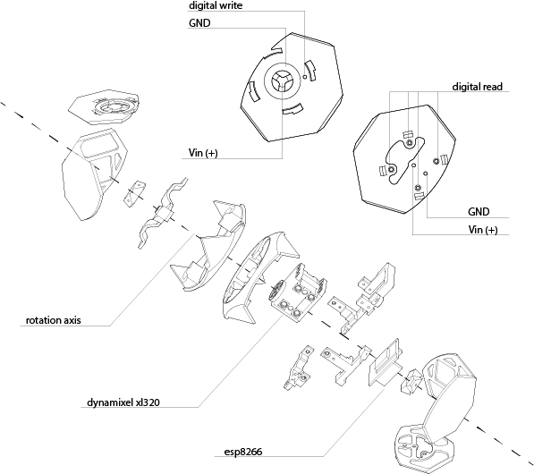

# CuGo (WIP)

CuGo is a board game developed by Kongpyung Moon and Peng Gao, in the Interactive Architecture Lab (IA Lab) at the Bartlett, UCL. The goal of the board game is to stag passive blocks on top of each other by collaborating with chained modular robots. The player has to move passive blocks on the board to a position where they think the robot can grab them. When the passive blocks are in reachable zone, robots use its inverse kinematic  intelligence to reach the passive units, but when they are not approachable, robots suggest to players one of their possible movements. 

## Material

* PLA Filament
* dynamixel xl 320 (Robotis)
http://www.robotis.us/dynamixel-xl-320/
* esp8266 (D1 Mini NodeMcu)
* Wifi router(smartphone hotspot also works)
* OpenCV Unity package has been used for tracking AR Markers(ArUco module)
This package has not been included in this repository.
https://assetstore.unity.com/packages/tools/integration/opencv-for-unity-21088
* Conductive plate(or conductive tape)
* 7.6V Adaptor
* 2mm x 2mm pogo pins
* 7.6V to 3.3V stepdown
https://www.amazon.co.uk/gp/product/B07DJZKMYM/ref=ppx_yo_dt_b_asin_title_o01_s01?ie=UTF8&psc=1

